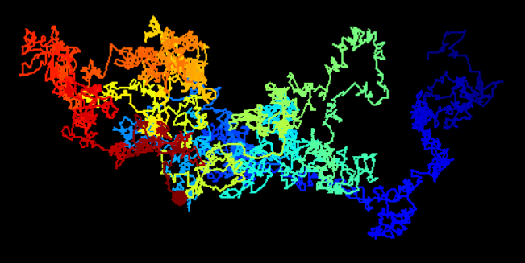
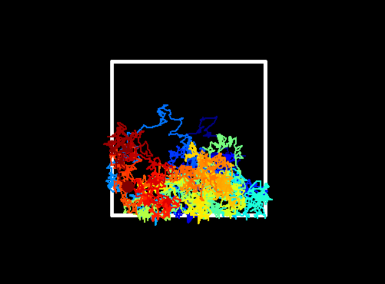
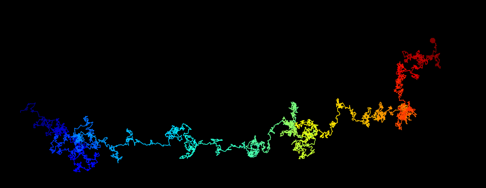
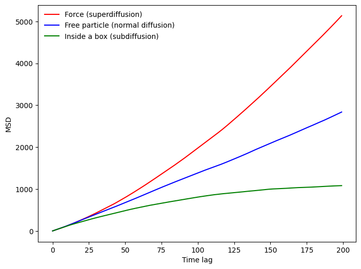

# Brownian Motion Simulations
This Python script simulates Brownian motion using the turtle, matplotlib, and numpy libraries. The simulation generates a random walk of a particle on the screen, records its position at each step, and saves the results to a CSV file.

# Brownian Motion Function
The brownian function creates a turtle screen, initializes a particle, and simulates its random walk. It takes three parameters:

scale: Determines the distance the particle moves in each step.
total_steps: Specifies the total number of steps the particle takes before the function stops.
dist_type: Specifies the type of distribution for the distance and turning angles ('normal' or 'random').
The function sets up the turtle environment, assigns colors to the particle using a colormap, and iterates through the specified number of steps, moving the particle accordingly. It records the particle's position at each step.

## Simulation 1: Brownian Motion in an Open Space



## Simulation 2: Brownian Motion in a Bounded Box


## Simulation 3: Brownian Motion with a Force


Each simulation demonstrates different scenarios of Brownian motion, including an open space, motion within a bounded box, and motion with an additional force. The results are saved in CSV files ('results.csv', 'results_box.csv', 'results_force.csv').


# Analysis of Brownian Motion Data
The data analysis includes plotting the total distance from the origin over time, calculating the mean square displacement (MSD), and determining the diffusivity constant through linear regression.




# How to Contribute

1.  Fork the repository
2.  Create a branch for your contribution: `git checkout -b my-contribution`
3.  Make desired changes and commit: `git commit -m "My contribution"`
4.  Push to your branch: `git push origin my-contribution`
5.  Create a Pull Request for review

# Requirements
Make sure to have the necessary libraries installed before running the simulations. You can install them using:
```bash
pip install -r requirements.txt
